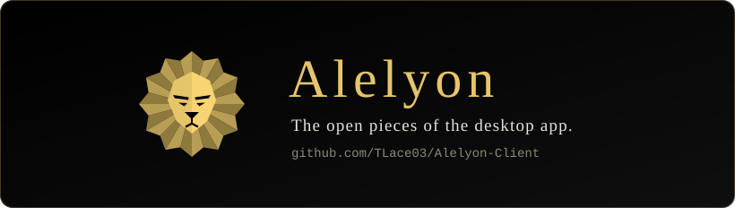

<div align="center">



<p>
  <a href="https://github.com/TLace03/Alelyon-Client/blob/main/LICENSE"></a>
  <a href="https://github.com/TLace03/Alelyon-Client/tree/main/crates/alelyon-identity-client"></a>
  <a href="https://github.com/TLace03/Alelyon-Client/blob/main/crates/alelyon-identity-client/Cargo.toml"></a>
  <a href="https://github.com/TLace03/Alelyon-Client/tree/main/crates/alelyon-identity-client/docs"></a>
</p>

<b>The open pieces of the Alelyon desktop app.</b>

Alelyon's desktop app comes with an account that follows you: sign in with a password,
GitHub, Google, Hugging Face or LinkedIn, or a QR code from your phone, and keep your
friends, presence and chats wherever you sign in. This repository opens the parts of the
client that others can build on, piece by piece. Each piece builds and tests on its own.

```bash
git clone https://github.com/TLace03/Alelyon-Client
cd Alelyon-Client/crates/alelyon-identity-client
cargo test --locked && cargo run --example status
```

</div>

> The example prints the live identity service's status (its state, notices and which ways
> of signing in are switched on) and needs no account. More about Alelyon:
> <https://www.alelyon.com/>.

## What is here

| Piece | What it does |
|---|---|
| [`alelyon-identity-client`](https://github.com/TLace03/Alelyon-Client/tree/main/crates/alelyon-identity-client) | The client of Alelyon's identity service, without a user interface: password sign-in, refresh and sign-out; provider sign-in through the system browser with PKCE and a loopback redirect; QR pairing; "stay signed in" sealed with Windows' DPAPI; and friends, presence and one-to-one chat. |
| [`lattice/`](https://github.com/TLace03/Alelyon-Client/tree/main/lattice) | Lattice, the app's chat and coding agent, as a Rust workspace of five crates: the run and chat contract (`lattice-protocol`), a port of the OpenAI Agents SDK (`lattice-agents`), the chat core with staged edits, a per-call policy, checkpoints, commands, skills, MCP servers and a managed llama.cpp server (`lattice-core`), the thin Win32 layer (`lattice-sys`), and a native window drawn with iced over wgpu (`lattice-app`). |
| [`sim/`](https://github.com/TLace03/Alelyon-Client/tree/main/sim) | Sinai's simulator, its CPU crates: the observation contract (`sim-contract`), one scene description with a MuJoCo MJCF importer (`sim-scene`), the world-state layout (`sim-world`), and the CPU reference of the physics core, ported from MuJoCo 3.14.0 and held to it by golden files (`sim-physics`). |
| [`sinai-face`](https://github.com/TLace03/Alelyon-Client/tree/main/crates/sinai-face) | Sinai's face, as the app draws it: the baked bust and every shape it can take (built from MakeHuman's CC0 base mesh and morph targets), its expressions, the appearance a person gives it with a share code and the file it is kept in, and the WGSL shaders that draw the bust, its valley and its sky. Plain arithmetic, tested without a window or a GPU. |

Each workspace builds and tests on its own, with its lockfile:

```bash
(cd lattice && cargo test --locked --workspace)
(cd sim && cargo test --locked --workspace)
(cd crates/sinai-face && cargo test --locked)
```

Its HTTP contracts are written out in full, so a client in another language can be built
from them alone:

- [Native sign-in contract](https://github.com/TLace03/Alelyon-Client/blob/main/crates/alelyon-identity-client/docs/native-sign-in-contract.md)
- [Social contract](https://github.com/TLace03/Alelyon-Client/blob/main/crates/alelyon-identity-client/docs/social-contract.md): friends, presence and chat

## Use it

```toml
[dependencies]
alelyon-identity-client = { git = "https://github.com/TLace03/Alelyon-Client" }
```

```rust
use alelyon_identity_client::{Client, client, vault};

async fn sign_in(login: &str, password: &str) -> Result<(), String> {
    let base = client::base_url().ok_or("signing in is switched off")?;
    let c = Client::new(base)?;
    let session = c.sign_in(login, password, true, None).await.map_err(|f| f.words())?;
    println!("signed in as {}", session.account.name());
    if let Some(at) = vault::path() {
        vault::keep(&at, &session.refresh_token)?; // sealed with DPAPI, never in the clear
    }
    Ok(())
}
```

The calls are `async` and run on any executor that can drive
[reqwest](https://docs.rs/reqwest). `ALELYON_IDENTITY_URL` points the client at another
service (for example a local stand-in), or `off` for none. The crate's own
[README](https://github.com/TLace03/Alelyon-Client/blob/main/crates/alelyon-identity-client/README.md)
has the full walkthrough.

## How it keeps you safe

- **Your password goes once, over TLS, and is never stored.** A session is an opaque
  refresh token that the service rotates on every refresh.
- **Provider sign-in never touches this app.** The system browser talks to GitHub, Google
  and the others; this client only ever sees a one-time code bound to a PKCE S256 challenge
  (RFC 7636), delivered to a loopback port (RFC 8252).
- **"Stay signed in" is sealed to you.** The refresh token is encrypted with Windows' DPAPI
  for the signed-in Windows user; another user, or a copy of the file on another PC, cannot
  open it. Unchecked, nothing is kept.
- **No token in logs.** A session's debug output leaves the token out, and transport errors
  are reduced to a few words, never the URL.

Security still rests on the service, not on keeping this source closed. If you find a
vulnerability, report it privately: see [SECURITY.md](SECURITY.md).

## This tree is generated

Everything here is produced from Alelyon's private repository by an exporter that copies an
explicit allowlist of files and refuses the export if any of them carries a secret, a
private path or a private project's name. A pull request editing those files cannot be
merged as-is, because the next export would overwrite it; an accepted change is ported into
the private source and comes back here in the next export, credited in the commit. See
[CONTRIBUTING.md](CONTRIBUTING.md).

`UPSTREAM.json` names the exact source commit and records a SHA-256 for every generated
file. It is self-declared traceability, not authenticated provenance.

Issues, discussions, and reports of anything wrong here are welcome and wanted; that is what
this repository is for.

## License

Licensed under the Apache License, Version 2.0
([LICENSE](https://github.com/TLace03/Alelyon-Client/blob/main/LICENSE) or
<https://www.apache.org/licenses/LICENSE-2.0>).

Unless you explicitly state otherwise, any contribution intentionally submitted for
inclusion in this work by you shall be licensed as above, without any additional terms or
conditions.
