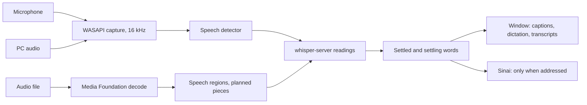

# alelyon-ears

The ears: live captions, dictation, the PC's own audio and audio files, turned into words on this PC. Its program,
`angel-ears`, is the speech engine Alelyon's Words page and Sinai's hearing connect to (`angel-ears serve`), and a
command line for files and live captions. A native Rust program built from three crates (`serde_json`,
`tungstenite`, `windows`): Windows audio is reached through WASAPI and Media Foundation directly, and the recogniser
is whisper.cpp's `whisper-server`, a separate program spoken to over loopback HTTP. The model it is set up for is
whisper large-v3-turbo, quantised to q5_0 (`ggml-large-v3-turbo-q5_0.bin`).

## What it does

| Use | How |
|---|---|
| Live captions | The microphone, or what the PC is playing, read as it is spoken. Words agreed on by two readings in a row are shown as settled; the rest stay grey until they settle. |
| Dictation | The microphone for typing: the same stream, marked `purpose: "dictation"`, so a window can put the words where the cursor is. |
| Sinai | The same stream, for Sinai to hear. Sinai acts only on speech addressed to it; the rest is dropped. |
| Audio files | WAV, and anything Windows can decode (MP3, M4A/AAC, WMA, FLAC), written out as text, SRT, WebVTT or JSON. |



| Module | What it is |
|---|---|
| `capture` | WASAPI shared mode, the microphone or the loopback of the default output. A silent loopback sends no packets, so silence is made up for it and time keeps moving. |
| `vad` | The speech detector: an energy threshold that follows the room's noise, a hold for speech that sounds unfinished, a cut at 30 s. |
| `stream`, `agreement` | Live readings. The utterance so far is re-read every 0.6 s, or less often when the recogniser is slow: after a reading of r seconds the next waits for 2r seconds of audio, so the captions never fall behind the speaker. A word becomes settled when two readings agree on it (LocalAgreement-2). The final words are the reading of the whole utterance. |
| `files` | Files: the speech detector finds the speech, and the file is cut into pieces of up to 28 s at its quietest moments, each read with the end of the text before it as context. A quiet recording is turned up for the detector (its loudest 1% to 0.1, by at most 20 times; nothing is turned down); the recogniser hears the audio as it is. Subtitle cues are at most 6 s and two lines of 42 characters, broken at punctuation, pauses or the start of a sentence. |
| `whisper`, `recognizer` | The recogniser: whisper.cpp's server, asked for `verbose_json`, every call bounded; and the one `serve` starts, in a Windows job object that ends it with the engine. |
| `server`, `events` | The service and its JSON events (below). |
| `setup` | Where `serve` finds the recogniser program and the model, and what it says when one is missing. |
| `media`, `wav`, `resample` | Decoding, WAV reading and writing, and the resampler to 16 kHz mono. |

The live detector's lowest start is 0.004 (30 ms RMS): on one headset microphone, speech read 0.014 (90th
percentile) to 0.028 (99th), and at 0.020 thirty seconds of talking started nothing (measured 2026-10-03). The gate
still sits four times above the room's measured noise, and while Sinai talks it keeps the higher floor (0.020 x
2.5), so a lower floor does not let Sinai hear itself.

## Setup

Neither the recogniser program nor the model is part of this crate, and nothing here downloads either. `serve`
looks for them here, and says which is missing and where to put it:

| What | Where `serve` looks |
|---|---|
| The model | `--model`, else `ANGEL_EARS_MODEL`, else `ggml-large-v3-turbo-q5_0.bin` in `~/.alelyon/angel/models/` |
| The recogniser | `--whisper-exe`, else `ANGEL_WHISPER_SERVER`, else `whisper-server.exe` beside `angel-ears.exe`, or in a `whisper` folder beside it (with the libraries its build made) |

`whisper-server` is built from [whisper.cpp](https://github.com/ggml-org/whisper.cpp) (MIT); its Vulkan build runs
the model on a graphics card. `--attach host:port` uses a whisper-server that is already running, and then neither
is needed.

## Use

```bash
angel-ears devices
angel-ears transcribe interview.m4a --format srt --out interview.srt
angel-ears listen --source mic --device C920 --seconds 30
angel-ears serve
```

`transcribe` and `listen` use a whisper-server at `--server` (default `127.0.0.1:8187`). `serve` starts its own (in a
job object that ends it with the service) unless `--attach host:port` names one. `listen` prints settled words to
stdout and the words in progress to stderr, and at the end says what it heard: seconds, the level (typical, 90th and
99th percentile, loudest) against the speech threshold, and how often speech began. A device that sends only digital
silence (a muted headset) is named as such. `--start-rms` sets the lowest start for one run.

The service is on port 8186 and its whisper-server on 8187, clear of 8178-8182, which Sinai's other local services
hold.

## The service

`serve` listens on `ws://127.0.0.1:8186/?token=<token>`. The port and a fresh random token are written to
`~/.alelyon/angel/ears.json` at each start. A connection without the token is refused (401), and so is any request
carrying an `Origin` header (403): that is a browser page, and no website may reach the ears.

Commands are JSON objects with `cmd` and an optional `id`, echoed in the reply (`ears.reply`, with `ok`):

| Command | Effect |
|---|---|
| `{"cmd":"state"}` | The on-air truth: what is listening, for what, and the recogniser's state. |
| `{"cmd":"listen","source":"mic"\|"pc","on":true\|false}` | Captions and Sinai from the microphone, or the PC's audio. |
| `{"cmd":"dictate","on":true\|false}` | The microphone for typing. |
| `{"cmd":"speaking","on":true\|false}` | Sinai is talking: the bar for starting speech is raised, so it does not hear itself. |
| `{"cmd":"transcribe_file","path":"...","formats":["txt","srt","vtt","json"],"out_dir":"..."}` | A file job; replies with its id. |
| `{"cmd":"cancel","job":"job-3"}` | Stops a file job. |

Events: `ears.state` (to every new client, and whenever anything is switched), `ears.speech` (speech began),
`ears.partial` (`stable` and `settling` text), `ears.final` (text, start, end, words with times and probabilities),
`ears.error`, and `ears.file` (a job's state, progress and outputs).

## Privacy

- Everything stays on this PC: capture, recognition and the socket are local, and the socket is loopback only.
- Nothing is stored unless someone saves it. File jobs write only where they are told to.
- The microphone is on only while a client asks for it, and `ears.state` always says so, so a window can show that it
  is on air. Each client's wishes are kept apart: when a window closes, crashes or loses its connection, what it asked
  for is withdrawn, and a device no other client wants stops.

## Measured

The large-v3-turbo q5_0 model on an RX 9070 XT (Vulkan, a whisper-server build with four threads), 2026-10-03:

| Measure | Value |
|---|---|
| Start until the server answers | 2.08 s |
| The server's own VRAM | 0.90 GiB after loading, 0.94 GiB after the readings; all of it returned when it stopped |
| First reading after start (4 s of speech) | 0.76 s |
| One reading, median of 5, English | 1 s: 0.163 s; 2 s: 0.172 s; 4 s: 0.183 s; 8 s: 0.212 s; 16 s: 0.257 s; 28 s: 0.317 s |
| The same with language detection (`auto`) | 4 s: 0.249 s; 8 s: 0.271 s (about 60 ms more; English found both times) |
| WER, 50 LibriSpeech test-clean clips (931 words, seed 20261003) | whole clips 3.54% (33 edits), the ears' file path 4.19% (39 edits) |
| Speed on those clips (344 s of audio) | whole clips 55.8x real time; the ears' file path 30.5x, a process start and decode per clip included |

The two WER figures are not a like-for-like comparison of the cutting. On the clips where the ears' path lost most
(7127-75947-0033, 61-70968-0040; re-read on the CPU with the same model), turbo wrote the trimmed audio with
punctuation and quotation marks and the whole clip, which starts in silence, in bare lowercase. The scoring keeps
apostrophes, so each quotation mark counts as an error, as does "Mlle" for "mademoiselle". A re-scoring with
quotation marks removed is UNMEASURED (the run kept counts, not texts).

The CPU test model `base.en`, same clips: whole clips 4.62% (43 edits), the file path's pieces 4.51% (42 edits),
before and again after the file path learned to turn quiet recordings up (8 of the 50 clips are turned up, by 1.15
to 2.1 times; the edits were the same). The RX figures above were measured on the build before that change.

## Build and test

Windows, Rust 1.97 or later. The crate is its own workspace with a committed lockfile:

```bash
cargo build --release --locked
cargo test --locked
```

No test opens a microphone, starts a recogniser or loads a model: the service's tests use a stand-in device and
ports the system picks, and the recogniser's tests a stand-in server.

## Limits

- Without a headset, Sinai can hear itself. `speaking` raises the bar while it talks; real echo cancellation is not
  built.
- No speaker labels.
- On the CPU, every reading costs about the same whatever its length (the model reads 30 s windows), about 1 s for
  `base.en` with four threads, so live captions need the GPU.
